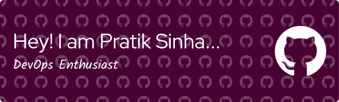

### Hi there everyone...👋

<!-- Not now  -->

<!--- <iframe>https://www.canva.com/design/DAGFv2JK1vk/hAihJrdMLBQyKr1zJ5dahQ/watch</iframe> -->

<!--
**pratiksinha-kol/pratiksinha-kol** is a ✨ _special_ ✨ repository because its `README.md` (this file) appears on your GitHub profile.

Here are some ideas to get you started:

- 🔭 I’m currently working on ...
- 🌱 I’m currently learning ...
- 👯 I’m looking to collaborate on ...
- 🤔 I’m looking for help with ...
- 💬 Ask me about ...
- 📫 How to reach me: ...
- 😄 Pronouns: ...
- ⚡ Fun fact: ...
-->

 

